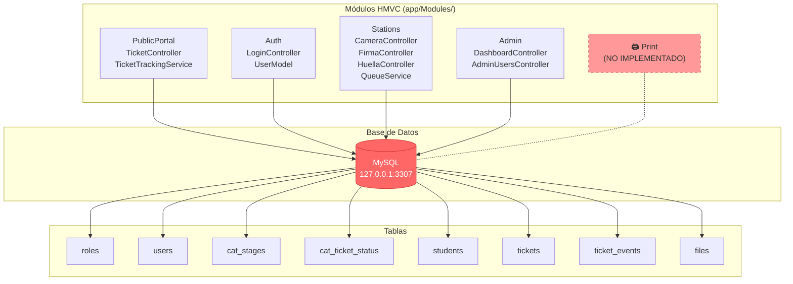

# 🔍 Auditoría Completa — Kiosco Credencialización

## Resumen Ejecutivo

He auditado a fondo el codebase PHP/CodeIgniter 4, probado el servidor en vivo, y analizado los logs.
El proyecto tiene una buena **arquitectura HMVC** y un esquema de datos bien pensado, pero tiene **errores que bloquean el uso** y deuda técnica significativa.

---

## 🔴 Error Crítico #1: Base de Datos No Conecta — TODA la app cae

> [!CAUTION]
> **El error más grave.** La base de datos MySQL no está corriendo o no es accesible, lo que provoca un **500 Internal Server Error** en TODAS las rutas que tocan BD.

### Síntomas verificados en vivo

| Ruta | Status | Resultado |
|------|--------|-----------|
| `GET /` | ❌ 500 | `Connection refused` |
| `GET /turnos/general` | ❌ 500 | `Connection refused` |
| `POST /login` (intento) | ❌ 500 | `Connection refused` |
| `GET /login` | ✅ 200 | Página carga (no toca BD) |
| `GET /captura/*` | 🔄 302 | Redirige a `/login` (AuthFilter funciona) |
| `GET /admin/*` | 🔄 302 | Redirige a `/login` (AuthFilter funciona) |

### Log exacto
```
CRITICAL -- CodeIgniter\Database\Exceptions\DatabaseException: 
Unable to connect to the database.
Main connection [MySQLi]: Connection refused
```

### Causa raíz
El `.env` apunta a `127.0.0.1:3307` pero el contenedor MySQL no está levantado:
```env
database.default.hostname = 127.0.0.1
database.default.database = kiosco
database.default.username = kiosco_user
database.default.password = kiosco_secret
database.default.port = 3307
```

### Solución
```bash
# Opción A: Si usas Docker
docker compose up -d   # (levanta MySQL en el puerto 3307)

# Opción B: MySQL local, ajustar el .env
database.default.hostname = 127.0.0.1
database.default.port = 3306   # puerto estándar MySQL local

# Después de conectar, ejecutar migraciones y seeders:
php spark migrate
php spark db:seed AuthSeeder
php spark db:seed KioscoSeeder
```

---

## 🔴 Error Crítico #2: `UserAdminModel` — Columnas Incorrectas

> [!WARNING]
> Este modelo no puede funcionar ni con la BD conectada. Usa nombres de columnas que **NO existen** en la migración.

### El problema en [UserAdminModel.php](file:///wsl$/Ubuntu-24.04/home/prome/personalProyects/kioscoCredencializacion/app/Modules/Admin/Models/UserAdminModel.php)

```php
// Línea 13: La tabla usa 'id' pero el modelo dice 'id_user'
protected $primaryKey = 'id_user';  // ❌ Debería ser 'id'

// Línea 25-26: Usa 'id_user' y 'id_role' que no existen
->select('users.id_user, ..., roles.code as role_code, roles.name as role_name')
->join('roles', 'roles.id_role = users.role_id', 'left')
//                       ^^^^^^^ No existe, la tabla roles usa 'id'
```

La migración real define:
- Tabla `users`: PK = `id` (no `id_user`)
- Tabla `roles`: PK = `id` (no `id_role`)

### Fix requerido
```diff
- protected $primaryKey = 'id_user';
+ protected $primaryKey = 'id';

  public function listWithRoles(): array
  {
-     return $this->select('users.id_user, users.username, ...')
-         ->join('roles', 'roles.id_role = users.role_id', 'left')
-         ->orderBy('users.id_user', 'DESC')
+     return $this->select('users.id, users.username, users.full_name, users.email, users.is_active, users.created_at, roles.code as role_code, roles.name as role_name')
+         ->join('roles', 'roles.id = users.role_id', 'left')
+         ->orderBy('users.id', 'DESC')
          ->findAll();
  }
```

---

## 🔴 Error Crítico #3: `RoleModel` — Columna "nombre" no existe

### El problema en [RoleModel.php](file:///wsl$/Ubuntu-24.04/home/prome/personalProyects/kioscoCredencializacion/app/Models/RoleModel.php)

```php
public function listAll(): array
{
    return $this->orderBy('nombre', 'ASC')->findAll();
    //                       ^^^^^^ ❌ La columna se llama 'name' en la migración
}
```

### Fix
```diff
- return $this->orderBy('nombre', 'ASC')->findAll();
+ return $this->orderBy('name', 'ASC')->findAll();
```

---

## 🟡 Bugs Importantes (No Críticos)

### 4. Código Legacy Muerto — `TurnoSeguimientoService` (español, tablas viejas)

> [!NOTE]
> Existe [TurnoSeguimientoService.php](file:///wsl$/Ubuntu-24.04/home/prome/personalProyects/kioscoCredencializacion/app/Services/TurnoSeguimientoService.php) en `app/Services/` que referencia tablas que **ya no existen**: `turnos`, `alumnos`, `cat_etapas`, `cat_estatus_turno`, con columnas en español como `id_turno`, `alumno_id`, `nombre_completo`, etc.

Este archivo es **completamente inútil** ahora. Ya fue reescrito y portado como `TicketTrackingService` bajo `Modules/PublicPortal/Services/`.

**Acción:** Eliminar `app/Services/TurnoSeguimientoService.php`. Es código muerto que confunde.

---

### 5. Modelos Legacy Muertos — `app/Models/`

Los modelos `TurnoEventoModel.php` y `RoleModel.php` en `app/Models/` son residuos de la migración. `TurnoEventoModel` probablemente referencia tablas viejas.

---

### 6. PDF Generator — Dependencia de LibreOffice

El [TicketPdfGenerator.php](file:///wsl$/Ubuntu-24.04/home/prome/personalProyects/kioscoCredencializacion/app/Modules/PublicPortal/Libraries/TicketPdfGenerator.php) usa `libreoffice --headless --convert-to pdf`.

**Problemas:**
- Requiere LibreOffice instalado en el servidor → pesado (~500MB+)
- La función `exec()` puede estar deshabilitada en hosting compartido
- No es apropiado para producción de alto volumen

**Recomendación:** Migrar a DOMPDF o TCPDF (librerías PHP puras, sin dependencias externas).

---

### 7. `TicketStatusModel::getInitialStatusId()` — Busca códigos que no existen

```php
$candidates = ['EN_COLA', 'EN_ESPERA', 'CREADO', 'ACTIVE'];
```

El seeder solo crea: `WAITING`, `IN_PROGRESS`, `FINISHED`, `CANCELLED`. Ninguno de los candidates matchea. Eventualmente cae al fallback `orderBy('id', 'ASC')`, pero es una inconsistencia que debería limpiarse.

---

### 8. Ruta `/turno/pdf/(:segment)` — Inconsistencia con la URL generada

La ruta está en Routes.php:
```php
$routes->get('turno/pdf/(:segment)', 'TicketController::downloadPdf/$1');
```

Pero en el `enrichTicket()` del `TicketTrackingService` genera:
```php
$ticket['pdf_url'] = $token ? base_url('ticket/pdf/' . $token) : null;  // 'ticket' no 'turno'
```

Esto produce una **URL inválida**. Debería ser `base_url('turno/pdf/' . $token)`.

---

### 9. KioscoSeeder — Genera tickets con `expires_at` ya expirados

```php
$ticket = [
    'expires_at' => date('Y-m-d 23:59:59', $ticketCreatedAt),
    'created_at' => date('Y-m-d H:i:s', $ticketCreatedAt),
];
```

`$ticketCreatedAt` se basa en `$student['created_at']` que puede ser de hasta 30 días atrás. **Todos esos tickets ya expiraron**, por lo que la cola de las estaciones siempre estará vacía. El seeder necesita actualizarse para generar tickets **del día de hoy**.

---

### 10. CSRF habilitado globalmente — AJAX puede fallar

En `Filters.php`:
```php
public array $globals = [
    'before' => [
        'csrf',
    ],
];
```

El CSRF está activado para TODAS las requests (incluyendo AJAX). Las vistas del dashboard y las estaciones sí pasan el token vía `csrf_hash()`, pero si falla la renovación del token después de una request, los siguientes POSTs AJAX fallarán con un 403 silencioso.

---

## 🟠 Problemas de Seguridad

| # | Issue | Severidad | Ubicación |
|---|-------|-----------|-----------|
| 1 | **Cloudflare Tunnel Token expuesto en `.env` commiteado** | 🔴 Alta | `.env` línea 58 |
| 2 | **Credenciales hardcoded en el seeder** (`Temporal1234`) | 🟡 Media | `AuthSeeder.php` línea 40 |
| 3 | **Contraseñas por defecto de BD en `.env`** | 🟡 Media | `.env` líneas 28-29 |
| 4 | **`AdminUsersController::allowForNow()` no valida roles** | 🟡 Media | Líneas 11-19 (comentado) |
| 5 | **Archivos debug/test en public/** | 🟠 Baja | `debug.php`, `info.php`, `test.php`, `diagnostic.php` |
| 6 | **`encryption.key` no está configurada** | 🟡 Media | `.env` línea 44 (comentada) |

---

## 🔵 Funcionalidades Pendientes (Roadmap)

### 🖨️ Módulo de Impresión de Credenciales (FALTA COMPLETO)

> [!IMPORTANT]
> Este es el módulo que mencionas. El sistema ya tiene la infraestructura para soportarlo (hay un rol `EST_PRINT`, un menú "Imprimir" en el layout, y un usuario `print` en el seeder), pero **no hay código implementado**.

**Lo que falta crear:**

| Componente | Archivo/Ruta | Descripción |
|------------|-------------|-------------|
| **Controller** | `app/Modules/Stations/Controllers/PrintController.php` | Cola de impresión, preview, acción de imprimir |
| **Model** | `app/Modules/Stations/Models/PrintModel.php` | Consulta alumnos con foto+firma+huella completos |
| **Vista cola** | `app/Views/captura/imprimir.php` | Vista con cola de credenciales listas |
| **Vista preview** | `app/Views/partials/print/panel_credencial.php` | Preview de la credencial antes de imprimir |
| **Template credencial** | `app/Views/public/credencial_template.php` | Diseño HTML/CSS de la credencial impresa |
| **Rutas** | `app/Config/Routes.php` | Agregar grupo `/captura/impresion/*` |
| **JS** | `public/assets/js/print-ui.js` | Lógica de preview e impresión |
| **CSS** | `public/assets/css/print.css` | Estilos de la credencial |
| **Evento** | Stage `PRINTED` en `cat_stages` | Nueva etapa en el catálogo |

**Flujo esperado:**
1. Alumno completa foto → firma → huella
2. Aparece en la cola de impresión
3. Operador previsualiza la credencial con los datos + foto
4. Presiona "Imprimir" → se envía a la impresora
5. Se registra el evento `credential_printed` en `ticket_events`
6. El turno se marca como `COMPLETED`/`FINISHED`

---

### Otras funcionalidades pendientes

| # | Feature | Estado | Prioridad |
|---|---------|--------|-----------|
| 1 | **Módulo Impresión** (descrito arriba) | 🔴 No iniciado | Crítica |
| 2 | **Control de roles por estación** — cada operador solo ve su estación | 🟡 Infraestructura existe, lógica no implementada | Alta |
| 3 | **Dashboard con gráficas** — tendencias, KPIs visuales | 🟡 Solo números, sin charts | Media |
| 4 | **Notificaciones en tiempo real** — WebSocket o polling para actualizar colas | 🟡 Polling manual | Media |
| 5 | **Exportar reportes** — CSV/Excel de turnos del día | 🔴 No existe | Media |
| 6 | **Editar/eliminar usuarios** — solo existe crear | 🟡 Parcial | Media |
| 7 | **Lector de huella real** — integración con hardware SDK | 🔴 Solo base64 manual | Alta (para producción) |
| 8 | **Tests unitarios/integración** — solo tiene la estructura base de CI4 | 🔴 Vacíos | Media |
| 9 | **Manejo robusto de sesiones expiradas** | 🟡 Básico | Baja |
| 10 | **Paginación en dashboard** — actualmente limitado a 8 registros | 🟡 Limitado | Media |

---

## 📋 Lista de Acción Prioritizada

### Para que el sistema funcione HOY:

1. **🔴 Levantar MySQL** — `docker compose up -d` o conectar a una BD local
2. **🔴 Ejecutar migraciones** — `php spark migrate`
3. **🔴 Ejecutar seeders** — `php spark db:seed AuthSeeder && php spark db:seed KioscoSeeder`
4. **🔴 Corregir `UserAdminModel.php`** — fix columnas `id_user` → `id`, `id_role` → `id`
5. **🔴 Corregir `RoleModel.php`** — `nombre` → `name`
6. **🔴 Corregir URL de PDF** — `ticket/pdf/` → `turno/pdf/` en `TicketTrackingService`

### Para limpieza inmediata:

7. **🟡 Eliminar `app/Services/TurnoSeguimientoService.php`** — código muerto
8. **🟡 Eliminar archivos debug en `public/`** — `debug.php`, `info.php`, `test.php`, `diagnostic.php`
9. **🟡 Regenerar tickets del seeder** con fechas de hoy
10. **🟡 Mover token de Cloudflare fuera del `.env` commiteado** (al `.gitignore` o variable de entorno real)

### Para próxima fase:

11. **🔵 Implementar módulo de Impresión de Credenciales**
12. **🔵 Migrar PDF de LibreOffice a DOMPDF/TCPDF**
13. **🔵 Activar validación de roles en `AdminUsersController`**
14. **🔵 Agregar tests**

---

## 🏗️ Resumen de Arquitectura Actual



> [!WARNING]
> El nodo rojo de la BD indica que actualmente la conexión falla. Todo el flujo está bloqueado por este error.
